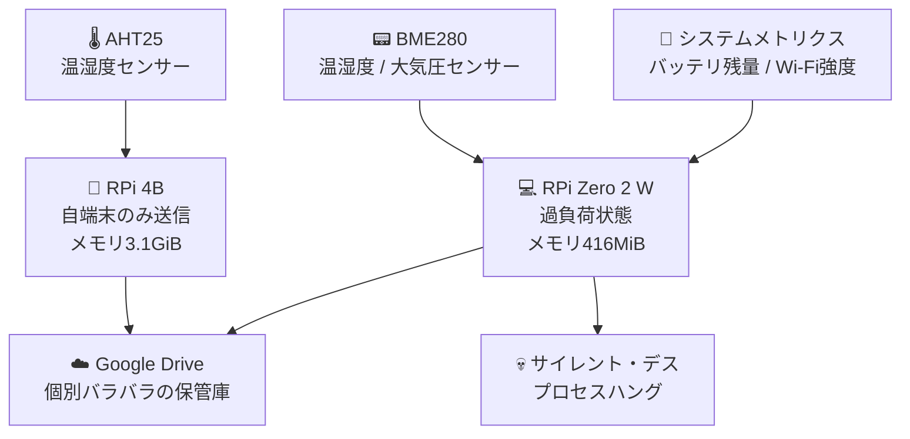
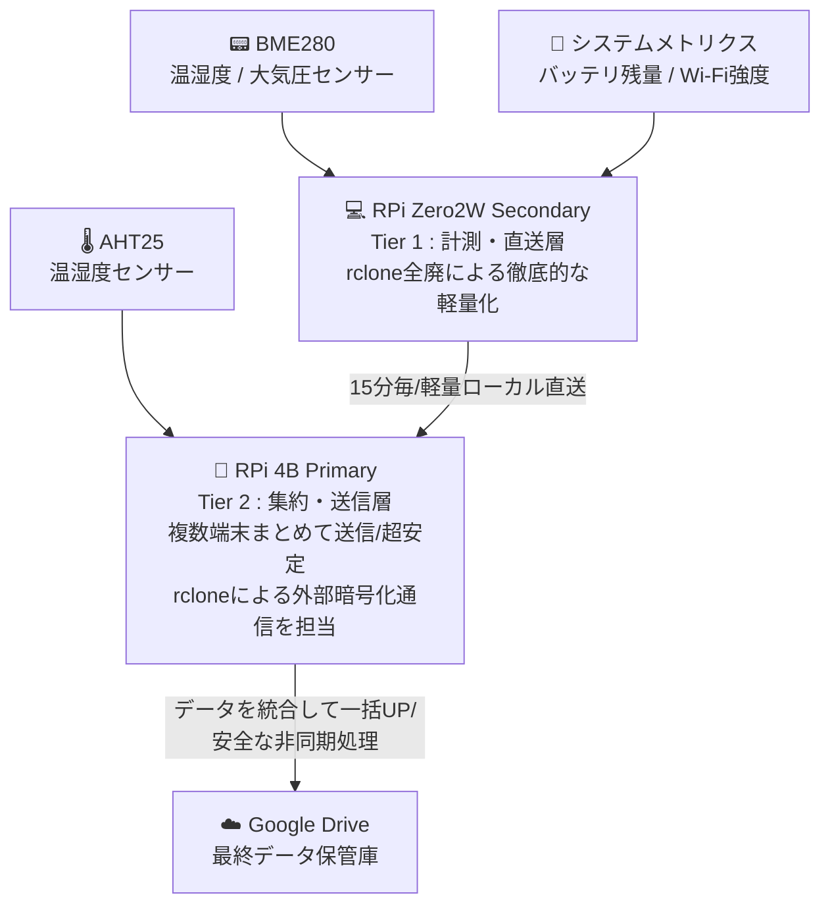

# システムアーキテクチャ設計書 (System Architecture Design Specification)

本ドキュメントは、分散型コンディションロギングシステム（Condition Logging System）における、ハードウェア、ソフトウェア、およびデータパイプラインの基本設計について定義する。

---

## 1. 開発背景とアーキテクチャ選定
従来の運用では、シングルエッジ端末（Raspberry Pi Zero 2 W）に「センサー計測」「ローカルデータ蓄積」「クラウドへの暗号化通信（rclone）」の全タスクを集中させていた。しかし、メモリリソースの逼迫（416MiB）とWi-Fiの瞬断が引き金となり、端末のハングアップ（サイレント・デス）が頻発する課題を抱えていた。

この課題を根本から解決するため、本システムでは、物理的なハードウェア資源と役割を完全に分離した **「2-Tier（二層）分散アーキテクチャ」** を採用する。

## 1.1 アーキテクチャ推移
### ■ Before

本システムの構築に先立ち、Raspberry Pi 4B / Zero 2 W 単体による運用（1-Tier構成）を実施した。その際の構造は以下の通りである。

---

### ■ After

本システムは、以下の2つの階層（Tier）で構成される。

---

## 1.2 システム運用環境・挙動比較表 (Before vs After)

従来運用（Before）の課題と、新アーキテクチャ（After）における改善アプローチの対比は以下の通りである。

| 評価項目 | Before: RPi Zero 2 W | Before: RPi 4B | ✨ After: 2-Tier 分散アーキテクチャ |
| :--- | :--- | :--- | :--- |
| **システムでの役割** | 現場での「センサー計測」から「クラウド直送」まで全担ぎ | 自端末の「センサー計測」および「クラウド直送」 | **【役割の完全分離】** Zero 2 W：計測・LAN内直送のみ 4B：集約・DB保存・クラウド一括送信 |
| **ハードウェア資源** | メモリ **416 MiB** (実空き: 約74MiBの極限状態) | メモリ **3.8 GiB** (実空き: 2.4GiBの超余裕) | 各端末の物理リソースを最適配置。 Zero 2 Wの負荷を極限まで引き下げ。 |
| **タスク駆動方式** | `systemd-timer` (`pipulse.timer`) 15分間隔で起動 | `crontab` `*/15 * * * *` (15分間隔) | **【非同期処理へ移行】** Zero 2 W：15分毎にNFSへ直送 4B：ローカルで定期集約＆非同期UP |
| **クラウド送信手段** | `Python` ➡️ `subprocess`経由で `rclone copy` を外部プロセス起動 | `Python` ➡️ `crontab`経由で `rclone` を実行 | **【Zero 2 Wのrclone全廃】** 4Bのみが内部でセキュアに `rclone` を叩き、一括パブリッシュを担当。 |
| **主要ファイル名** | ・`pipulse_YYYY-MM.txt` ・`latest_pipulse.txt` (JSON風テキストフォーマット) | ・`temp_humid_YYYY-MM.txt` ・`latest_temp_humid.txt` (個別CSVフォーマット) | 📑 **【完全一本化】** 4BのSQLite3で時間軸を同期して結合。 **統一レポート形式**でクラウドへ転送。 |
| **通信エラー時の挙動** | ❌ **サイレント・デス (フリーズ)** OAuth2トークン更新時のWi-Fi瞬断でプロセスがハングアップ。 | ⭕️ **192日以上の連続安定稼働** 潤沢なメモリで通信エラーを完全許容。 | 🛠️ **【障害耐性の劇的向上】** Zero 2 WはLAN内送信のみで超安定。 外回りのエラーは4Bがすべて吸収。 |
| **データ生存性** | ❌ 接続エラー時にその場の最重要データ（電圧・RSSI等）が**全喪失**。 | 🔺 自端末の環境データのみローカル保護。 | ⭕️ ネットワーク遮断時も、4Bの**SQLite3へ確実にバッファ（蓄積）**され消失ゼロ。 |

---

## 1.3 従来運用（単一端末アーキテクチャ）の技術的ボトルネック解析

実機ログおよびリソース調査（`free -h`, `top`, `up 192 days`）から判明した、従来の1-Tier運用における構造的欠陥の解析結果は以下の通りである。

### 1. エッジ端末（Zero 2 W）への暗号化・認証処理の集中と通信ブロック
実機の空きメモリが常に `74MiB` 前後という極限状態において、15分間隔の駆動のたびにPythonからGo言語製の重厚な `rclone` プロセスを `subprocess` で外部呼び出ししていた。HTTPS暗号化計算（SSL/TLSハンドシェイク）とOAuth2トークンのリフレッシュ処理が一時的なメモリのスパイクを招き、Wi-Fiの微弱な瞬断が発生した瞬間に以下の通信エラーを吐いてプロセスがブロッキングされ、サイレント・デス（完全フリーズ）を引き起こしていた。
> `Failed to create file system: couldn't fetch token - refresh with rclone config reconnect: Post ... connect: no route to host`

### 2. ハードウェア資源の著しい不均衡と運用の非効率
調査により、メインサーバーである RPi 4B はメモリを `2.4GiB` も残し、`192 days`（半年以上）もの連続安定稼働を平然と継続していることが判明した。その一方で、4Bは `crontab` 経由で自身の `temp_humid_*.txt` を送るのみであり、隣にあるZero 2 Wの悲鳴（リソース枯渇によるフリーズ）を物理的に救済できない「個別バラバラ送信」の構造的欠陥を抱えていた。

### 3. エラーハンドリングの限界とデータ全喪失
HTTPSの暗号化通信をエッジ端末（Zero 2 W）に直接持たせていたため、ネットワークに起因する例外が発生した際、死ぬ直前の最重要テレメトリ（Wi-Fi強度 `rssi` やバッテリー電圧 `battery_mv`）自体をクラウドに送り届けることも、ローカルに残すこともできず消失していた。

### 4. データフォーマットの不統一と同期の欠如
Googleドライブ上には、Zero 2 W側が出力するJSON風テキスト形式（`pipulse_*.txt`）と、4B側が出力するCSV形式（`temp_humid_*.txt`）が、それぞれ異なるフォーマット・異なるタイミングで同期なく配置されており、マスターがスマホ等で環境全体のコンディションを俯瞰する際の大きな妨げとなっていた。

---

## 2. データフォーマット推移・比較 (Data Format Evolution)

本システムにおける、各通信区間でのデータ形式（フォーマット）の Before / After 比較は以下の通りである。

### ■ Before（従来：個別バラバラ送信）
従来運用では、各端末がそれぞれのフォーマットで、かつ異なるタイミングで直接クラウドへ送信していた。

| 送信元 ➡️ 送信先 | フォーマット形式 | データ項目の例 | 課題・特徴 |
| :--- | :--- | :--- | :--- |
| **RPi Zero 2 W** ➡️ クラウド | **個別ログ (JSON風テキスト)** | `timestamp, cpu_temp, battery_mv, rssi` | 単一端末のメトリクスのみ。Wi-Fi瞬断時に外部プロセス負荷でハングしデータ消滅。 |
| **RPi 4B** ➡️ クラウド | **個別CSV (フラットテキスト)** | `timestamp, room_temp, room_humi` | 4Bが独自に測定した環境データのみ。Zero 2 Wのデータとは時間軸が同期していない。 |

---

### ■ After（新アーキ：NFS直送 ➡️ SQLite統合 ➡️ 統一パブリッシュ）
新アーキでは、Zero 2 WはBeforeの軽量ログ出力をそのまま活かしてNFSポストへ直送し、4B側でタイムスタンプをキーにして**完全な一本化（統一フォーマット化）**を行う。

| 区間・フェーズ | フォーマット形式 | データ項目の例 | 役割・メリット |
| :--- | :--- | :--- | :--- |
| **① ステージング** (Zero 2 W ➡️ 4B NFS) | **個別ログ (Before互換テキスト)** | `timestamp, cpu_temp, battery_mv, rssi` | **【Zeroの変更は最小限】** rcloneを完全に排除し、生のテキストデータをLAN内直送するだけで負荷極小。 |
| **② 構造化・統合** (4Bローカル ➡️ SQLite3) | **DBスキーマ (構造化)** | `datetime(PK), cpu_temp, battery_mv, rssi, room_temp, room_humi` | **【4B内でガッチャンコ】** Zeroのシステムデータと4Bの環境データを, 時間軸をピッタリ合わせて1レコードに結合。 |
| **③ 可視化パブリッシュ** (4B ➡️ クラウド) | ✨ **統一レポート形式** (統合CSV / スプレッドシート) | `日時, 端末温度, 電池残量, 電波強度, 部屋温度, 部屋湿度` | **【スマホ閲覧の最適化】** マスターがスマホで開いた瞬間に、すべてのコンディションが一画面で把握可能。 |
