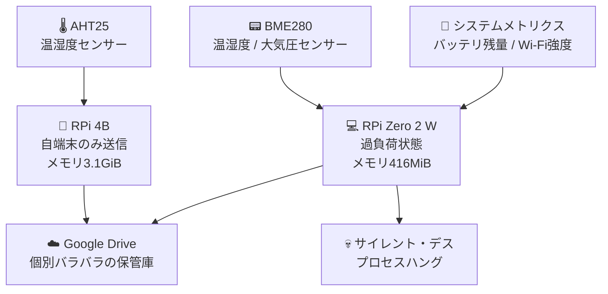
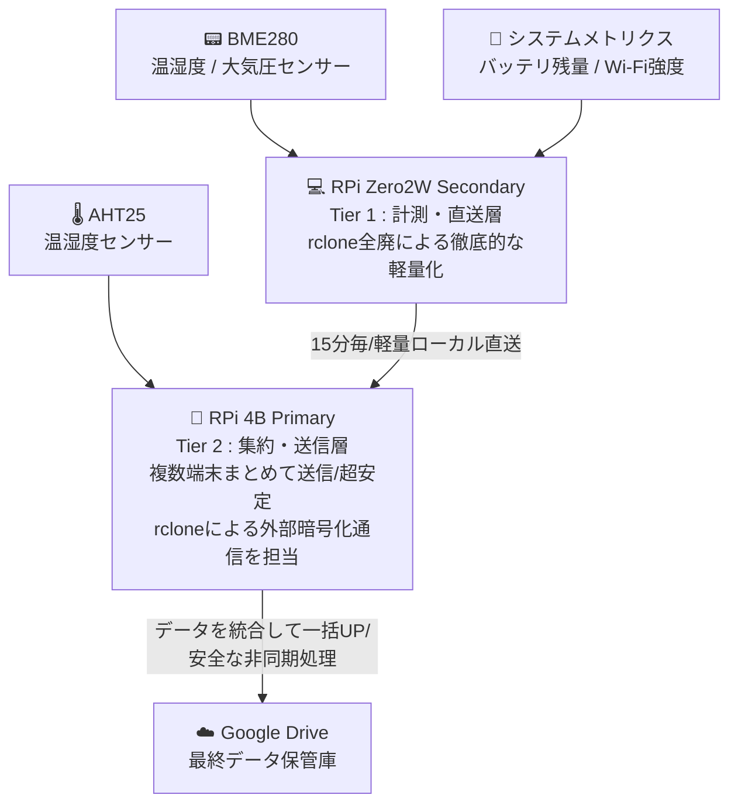

# システムアーキテクチャ設計書 (System Architecture Design Specification)

本ドキュメントは、分散型コンディションロギングシステム（Condition Logging System）における、ハードウェア、ソフトウェア、およびデータパイプラインの基本設計について定義する。

---

## 1. 開発背景とアーキテクチャ選定
従来の運用では、シングルエッジ端末（Raspberry Pi Zero 2 W）に「センサー計測」「ローカルデータ蓄積」「クラウドへの暗号化通信（rclone）」の全タスクを集中させていた。しかし、メモリリソースの逼迫（416MiB）とWi-Fiの瞬断が引き金となり、端末のハングアップ（サイレント・デス）が頻発する課題を抱えていた。

この課題を根本から解決するため、本システムでは、物理的なハードウェア資源と役割を完全に分離した **「2-Tier（二層）分散アーキテクチャ」** を採用する。

## 1.1 アーキテクチャ推移
### ■ Before

本システムの構築に先立ち、Raspberry Pi 4B / Zero 2 W 単体による運用（1-Tier構成）を実施した。その際の構造は以下の通りである。

---

### ■ After

本システムは、以下の2つの階層（Tier）で構成される。

## 2. データフォーマット推移・比較 (Data Format Evolution)

本システムにおける、各通信区間でのデータ形式（フォーマット）の Before / After 比較は以下の通りである。

### ■ Before（従来：個別バラバラ送信）
従来運用では、各端末がそれぞれのフォーマットで、かつ異なるタイミングで直接クラウドへ送信していた。

| 送信元 ➡️ 送信先 | フォーマット形式 | データ項目の例 | 課題・特徴 |
| :--- | :--- | :--- | :--- |
| **RPi Zero 2 W** ➡️ クラウド | **個別CSV (軽量)** | `timestamp, cpu_temp, battery_mv, rssi` | 単一端末のメトリクスのみ。Wi-Fi瞬断時にデータが消滅。 |
| **RPi 4B** ➡️ クラウド | **個別CSV (リッチ)** | `timestamp, room_temp, room_humi` | 4Bが独自に測定した環境データのみ。Zero 2 Wのデータとは時間軸が同期していない。 |

---

### ■ After（新アーキ：NFS直送 ➡️ SQLite統合 ➡️ 統一パブリッシュ）
新アーキでは、Zero 2 WはBeforeの軽量フォーマットをそのまま維持してNFSポストへ直送し、4B側でタイムスタンプをキーにして**完全な一本化（統一フォーマット化）**を行う。

| 区間・フェーズ | フォーマット形式 | データ項目の例 | 役割・メリット |
| :--- | :--- | :--- | :--- |
| **① ステージング** (Zero 2 W ➡️ 4B NFS) | **個別CSV (Before互換)** | `timestamp, cpu_temp, battery_mv, rssi` | **【Zeroの変更は最小限】** rcloneを廃止し、素のCSVテキストをLAN内直送するだけで負荷極小。 |
| **② 構造化・統合** (4Bローカル ➡️ SQLite3) | **DBスキーマ (構造化)** | `datetime(PK), cpu_temp, battery_mv, rssi, room_temp, room_humi` | **【4B内でガッチャンコ】** Zeroのデータと4Bの環境データを、時間軸をピッタリ合わせて1レコードに結合。 |
| **③ 可視化パブリッシュ** (4B ➡️ クラウド) | ✨ **統一レポート形式** (統合CSV / スプレッドシート) | `日時, 端末温度, 電池残量, 電波強度, 部屋温度, 部屋湿度` | **【スマホ閲覧の最適化】** マスターがスマホで開いた瞬間に、すべてのコンディションが一画面で把握可能。 |
