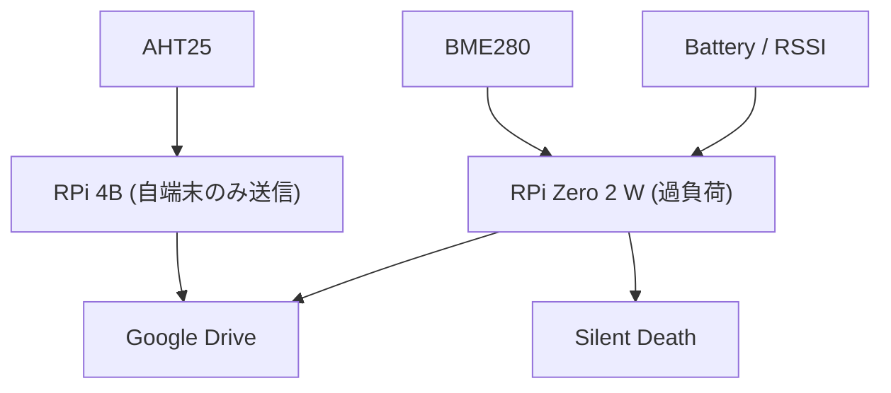
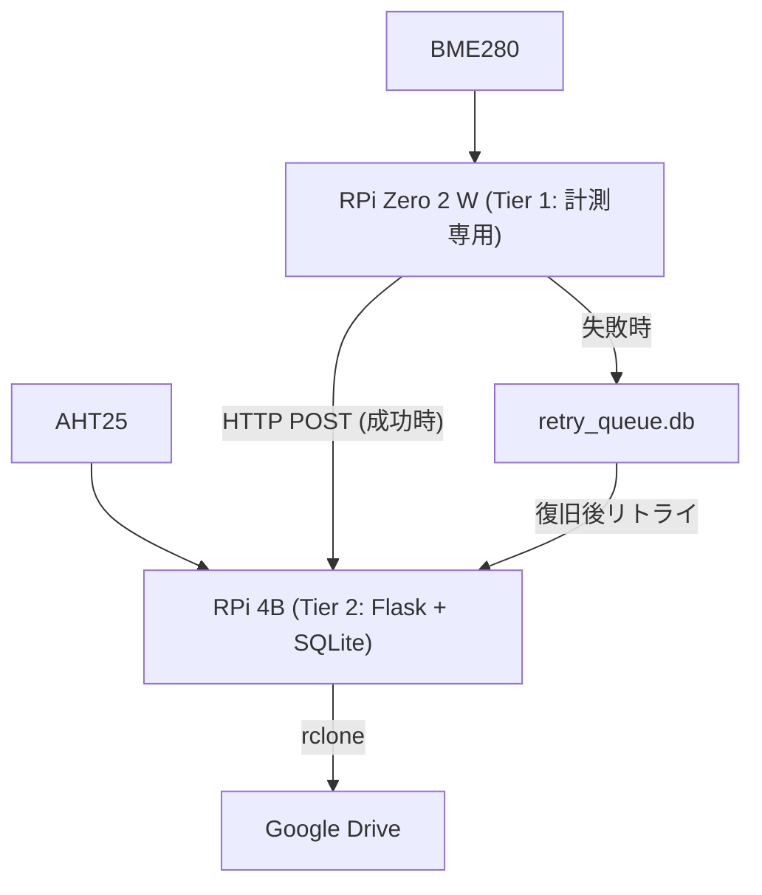

# システムアーキテクチャ設計書（Flask版）

本ドキュメントは、ConditionLoggingSystem の現行アーキテクチャ（2026-07時点）を定義する。

---

## 1. 開発背景とアーキテクチャ変遷

### 従来の課題（1-Tier / rclone直送時代）

- Raspberry Pi Zero 2 W にセンサー計測・ローカル蓄積・クラウド送信を集中
- メモリ逼迫（空き約74MiB）＋ rclone の負荷により **サイレント・デス** が頻発
- 通信エラー時に重要テレメトリが消失

### 現行アーキテクチャ（Flask + HTTP POST）

役割を完全分離した **2-Tier 構成** に移行。

- **子機（Zero 2 W）**: 計測専用。通信成功時はSD書き込みゼロ、失敗時のみローカルSQLite退避
- **親機（Raspberry Pi 4B）**: 常駐Flaskサーバーで受信・集約・バックアップを担当

---

## 2. 全体構成図

### Before（rclone直送時代）


```mermaid
graph TD
    Drive["Google Drive"]
    Pi4B["RPi 4B (自端末のみ送信)"]
    AHT25["AHT25"]
    Zero2W["RPi Zero 2 W (過負荷)"]
    BME280["BME280"]
    Metrics["Battery / RSSI"]
    Death["Silent Death"]

    AHT25 --> Pi4B
    Pi4B --> Drive
    BME280 --> Zero2W
    Metrics --> Zero2W
    Zero2W --> Drive
    Zero2W --> Death
```
### After（Flask版）

```mermaid
graph TD
    Drive["Google Drive"]
    Pi4B["RPi 4B (Tier 2: Flask + SQLite)"]
    AHT25["AHT25"]
    Zero2W["RPi Zero 2 W (Tier 1: 計測専用)"]
    BME280["BME280"]
    Retry["retry_queue.db"]

    BME280 --> Zero2W
    AHT25 --> Pi4B
    Zero2W -->|"HTTP POST (成功時)"| Pi4B
    Zero2W -->|"失敗時"| Retry
    Retry -->|"復旧後リトライ"| Pi4B
    Pi4B -->|"rclone"| Drive
```

## 3. データフロー詳細

### 3.1 子機（Zero 2 W）処理フロー
1. BME280 から温度・湿度・気圧を取得
2. 親機へ HTTP POST を試行（`X-API-Key` ヘッダ付き）
3. **成功時**: 何もローカルに残さず終了（SDカード保護）
4. **失敗時**: `retry_queue.db` にレコードを退避
5. 次回起動時または Wi-Fi 復旧検知時にリトライ

### 3.2 親機（Raspberry Pi 4B）処理フロー
1. Flask アプリがポート 8000 で常駐
2. 受信リクエストに対して:
   - `X-API-Key` 認証
   - 簡易バリデーション
   - `zero2w_logs` テーブルへ INSERT
3. 別プロセス（15分ごと）で 4B 自身のセンサー測定（AHT25） → `rpi4b_logs` へ直接書き込み
4. 定期的に `rclone` で Google Drive へバックアップ

## 4. タイミングと同時書き込みについて

Zero 2 W と 4B は **独立したタイマー** で動作しており、時刻同期は NTP 依存（完全同期ではない）。

| パターン | 状況 | 影響 | 対策 |
|---|---|---|---|
| **どちらかが早い** | 時間差あり | ほぼなし | 特に不要 |
| **どちらかが遅い** | 時間差あり | ほぼなし | 特に不要 |
| **ほぼ同時** | 両書き込みが重なる | `SQLITE_BUSY` の可能性 | WAL + `busy_timeout` + 簡易リトライ |

### 採用する最低限の防御策
両書き込み経路（Flask受信・4B自測定）で共通して以下を適用する:

```python
conn = sqlite3.connect(db_path, timeout=10.0)
conn.execute("PRAGMA journal_mode=WAL;")
conn.execute("PRAGMA busy_timeout = 10000;")
conn.execute("PRAGMA synchronous=NORMAL;")
```

書き込み時は短いトランザクションを使用する。
これで「ほぼ同時」ケースでも実用上問題にならないレベルまで低減できる。
### Note:
書き込み専用プロセスへの完全集約は、現時点ではオーバースペックと判断し見送り。実運用で BUSY エラーが頻発する場合に再検討する。

## 5. 主要コンポーネント一覧

| コンポーネント | 場所 | 役割 | 使用技術 |
|---|---|---|---|
| **センサー読み取り** | Zero 2 W | BME280からデータ取得 | `smbus2` |
| **ローカル退避** | Zero 2 W | 通信失敗時の安全保管 | SQLite3 (WAL) |
| **送信クライアント** | Zero 2 W | 4Bへデータ送信 | `requests` / `urllib` |
| **レシーバー** | 4B | データ受信窓口 | Flask |
| **データベース** | 4B | 全データ一元集約 | SQLite3 (WAL) |
| **4B自身の測定** | 4B | AHT25測定 → 直接DB書き込み | `smbus2` + `sqlite3` |
| **クラウドバックアップ** | 4B | Googleドライブ同期 | `rclone` |

## 6. 設計上の重要ポイント

- **センサー構成**: Zero 2 W = BME280（温度・湿度・気圧） / 4B = AHT25（温度・湿度）
- **SDカード保護**: 
  - Zero 2 W → 成功時は書き込みゼロ（失敗時のみローカルSQLiteへ退避）
  - 4B自炊データ → HTTPを経由せず直接DB書き込み（無駄なオーバーヘッド排除）
- **DB安全性**: WALモード + `busy_timeout` + `synchronous=NORMAL` で同時書き込みに備える
- **拡張性**: `device_id` カラムで複数子機を区別可能
- **認証**: シンプルな `X-API-Key` 方式（同一LAN内運用を前提）
- **耐障害性**: 通信断が発生してもデータ消失ゼロ
- **システムメトリクス**: バッテリー・RSSI等は次ステップ（まずは3点連携を優先）

## 7. データベース設計（概要）

- **ファイル**: `/home/hideo_81_g/condition_logging/condition_logging.db`
- **モード**: WAL（Write-Ahead Logging）

### `zero2w_logs` テーブル

| カラム | 型 | 説明 |
|---|---|---|
| `id` | INTEGER | PRIMARY KEY 自動採番 |
| `device_id` | TEXT | 端末識別子 |
| `timestamp` | TEXT | 測定時刻 |
| `temperature` | REAL | 温度 |
| `humidity` | REAL | 湿度 |
| `pressure` | REAL | 気圧 |
| `battery_voltage` | REAL | バッテリー電圧（将来用） |
| `battery_percent` | REAL | バッテリー残量（将来用） |
| `wifi_rssi` | INTEGER | Wi-Fi強度（将来用） |
| `status_code` | TEXT | ステータス |
| `received_at` | TEXT | 4B受信時刻 |

### `rpi4b_logs` テーブル

| カラム | 型 | 説明 |
|---|---|---|
| `id` | INTEGER | PRIMARY KEY 自動採番 |
| `device_id` | TEXT | 端末識別子 |
| `created_at` | TEXT | 測定時刻 |
| `temperature` | REAL | 温度 |
| `humidity` | REAL | 湿度 |

## 8. 移行戦略（既存コード最小変更）

### 基本方針
- 測定ロジック（BME280 / AHT25）は一切触らない
- 既存の cron / 起動方法は維持
- 新しい経路（HTTP）を追加し、段階的に切り替える

### フェーズ

| Phase | 内容 | 状態 |
|---|---|---|
| **Phase 0** | 準備（ディレクトリ作成・IP確認・APIキー決定） | 完了 |
| **Phase 1** | 4B側 Flaskレシーバー作成・systemd常駐化 | 進行中 |
| **Phase 2** | Zero 2 W側 送信ロジックをHTTPに一発切り替え（失敗時ローカル退避） | 未着手 |
| **Phase 3** | 動作確認・完成 | 未着手 |

### 変更量のイメージ

| 対象 | 変更の大きさ | 内容 |
|---|---|---|
| **4B SensorCopier** | ほぼゼロ | 触らない |
| **4B 新規Flask** | 新規作成 | 受信専用 |
| **Zero 2 W main.py / storage.py** | 小〜中 | 送信部分にHTTPを追加 |
| **Zero 2 W 測定ロジック** | ゼロ | 触らない |

## 9. 今後の実装優先順位

1. 4B側 Flask レシーバーの systemd 常駐化完了
2. Zero 2 W側 送信＋リトライキュー実装
3. 4B自身の測定データを同じDBに統合（任意）
4. rclone によるDBバックアップ整備
5. システムメトリクス（バッテリー・RSSI）の追加
6. 統合レポート・可視化（必要に応じて）

---
*最終更新: 2026-07-26*
