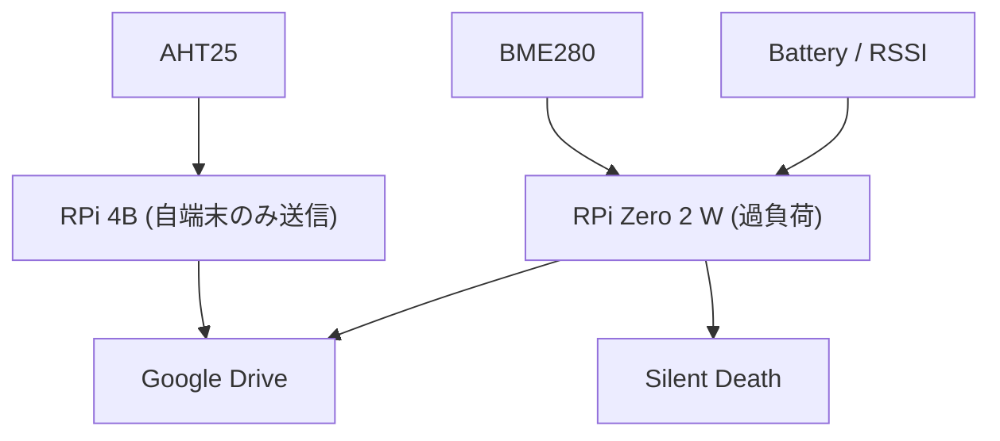
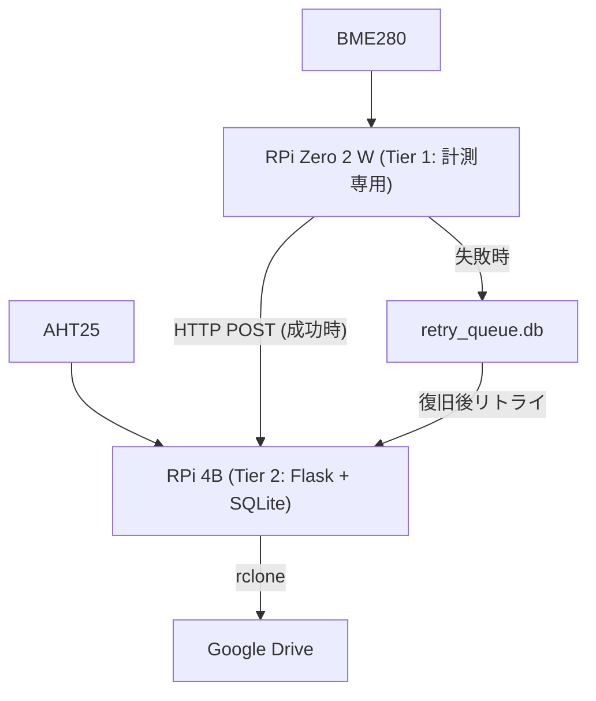

# システムアーキテクチャ設計書（Flask版）

本ドキュメントは、ConditionLoggingSystem の現行アーキテクチャ（2026-08時点）を定義する。

---

## 1. 開発背景とアーキテクチャ変遷

### 従来の課題（1-Tier / rclone直送時代）

- Raspberry Pi Zero 2 W にセンサー計測・ローカル蓄積・クラウド送信を集中
- メモリ逼迫（空き約74MiB）＋ rclone の負荷により **サイレント・デス** が頻発
- 通信エラー時に重要テレメトリが消失

### 現行アーキテクチャ（Flask + HTTP POST）

役割を完全分離した **2-Tier 構成** に移行。

- **子機（Zero 2 W）**: 計測専用。通信成功時はSD書き込みゼロ、失敗時のみローカルSQLite退避
- **親機（Raspberry Pi 4B）**: 常駐Flaskサーバーで受信・集約・バックアップを担当

---

## 2. 全体構成図

### Before（rclone直送時代）


```mermaid
graph TD
    Drive["Google Drive"]
    Pi4B["RPi 4B (自端末のみ送信)"]
    AHT25["AHT25"]
    Zero2W["RPi Zero 2 W (過負荷)"]
    BME280["BME280"]
    Metrics["Battery / RSSI"]
    Death["Silent Death"]

    AHT25 --> Pi4B
    Pi4B --> Drive
    BME280 --> Zero2W
    Metrics --> Zero2W
    Zero2W --> Drive
    Zero2W --> Death
```
### After（Flask版）

```mermaid
graph TD
    Drive["Google Drive"]
    Pi4B["RPi 4B (Tier 2: Flask + SQLite)"]
    AHT25["AHT25"]
    Zero2W["RPi Zero 2 W (Tier 1: 計測専用)"]
    BME280["BME280"]
    Retry["retry_queue.db"]

    BME280 --> Zero2W
    AHT25 --> Pi4B
    Zero2W -->|"HTTP POST (成功時)"| Pi4B
    Zero2W -->|"失敗時"| Retry
    Retry -->|"復旧後リトライ"| Pi4B
    Pi4B -->|"rclone"| Drive
```

## 3. データフロー詳細

### 3.1 子機（Zero 2 W）処理フロー
1. BME280 から温度・湿度・気圧を取得
   - 失敗時: ソフトリセット後に再試行1回。それでも失敗なら null として続行
2. バッテリー・RSSI 等、取得できるメトリクスは欠測と独立に取得
3. 親機へ HTTP POST を試行（`X-API-Key` ヘッダ付き）
4. **成功時**: 何もローカルに残さず終了（SDカード保護）
5. **失敗時**: `retry_queue.db` にレコードを退避
6. 次回起動時または Wi-Fi 復旧検知時にリトライ

### 3.2 親機（Raspberry Pi 4B）処理フロー
1. Flask アプリがポート 8000 で常駐
2. 受信リクエストに対して:
   - `X-API-Key` 認証
   - 簡易バリデーション
   - `zero2w_logs` テーブルへ INSERT
3. 別プロセス（15分ごと）で 4B 自身のセンサー測定（AHT25） → `rpi4b_logs` へ直接書き込み
4. 定期的に `rclone` で Google Drive へバックアップ

## 4. タイミングと同時書き込みについて

Zero 2 W と 4B は **独立したタイマー** で動作しており、時刻同期は NTP 依存（完全同期ではない）。

| パターン | 状況 | 影響 | 対策 |
|---|---|---|---|
| **どちらかが早い** | 時間差あり | ほぼなし | 特に不要 |
| **どちらかが遅い** | 時間差あり | ほぼなし | 特に不要 |
| **ほぼ同時** | 両書き込みが重なる | `SQLITE_BUSY` の可能性 | WAL + `busy_timeout` + 簡易リトライ |

### 採用する最低限の防御策
両書き込み経路（Flask受信・4B自測定）で共通して以下を適用する:

```python
conn = sqlite3.connect(db_path, timeout=10.0)
conn.execute("PRAGMA journal_mode=WAL;")
conn.execute("PRAGMA busy_timeout = 10000;")
conn.execute("PRAGMA synchronous=NORMAL;")
```

書き込み時は短いトランザクションを使用する。
これで「ほぼ同時」ケースでも実用上問題にならないレベルまで低減できる。
### Note:
書き込み専用プロセスへの完全集約は、現時点ではオーバースペックと判断し見送り。実運用で BUSY エラーが頻発する場合に再検討する。

## 5. 主要コンポーネント一覧

| コンポーネント | 場所 | 役割 | 使用技術 |
|---|---|---|---|
| **センサー読み取り** | Zero 2 W | BME280からデータ取得 | `smbus2` |
| **ローカル退避** | Zero 2 W | 通信失敗時の安全保管 | SQLite3 (WAL) |
| **送信クライアント** | Zero 2 W | 4Bへデータ送信 | `requests` / `urllib` |
| **レシーバー** | 4B | データ受信窓口 | Flask |
| **データベース** | 4B | 全データ一元集約 | SQLite3 (WAL) |
| **4B自身の測定** | 4B | AHT25測定 → 直接DB書き込み | `smbus2` + `sqlite3` |
| **クラウドバックアップ** | 4B | Googleドライブ同期 | `rclone` |

## 6. 設計上の重要ポイント

- **センサー構成**: Zero 2 W = BME280（温度・湿度・気圧） / 4B = AHT25（温度・湿度）
- **SDカード保護**: 
  - Zero 2 W → 成功時は書き込みゼロ（失敗時のみローカルSQLiteへ退避）
  - 4B自炊データ → HTTPを経由せず直接DB書き込み（無駄なオーバーヘッド排除）
- **DB安全性**: WALモード + `busy_timeout` + `synchronous=NORMAL` で同時書き込みに備える
- **拡張性**: `device_id` カラムで複数子機を区別可能
- **認証**: シンプルな `X-API-Key` 方式（同一LAN内運用を前提）
- **耐障害性**: 通信断が発生してもデータ消失ゼロ ※耐障害性に関してセクション10を参照。
- **システムメトリクス**: バッテリー・RSSI等は次ステップ（まずは3点連携を優先）

## 7. データベース設計（概要）

環境値・電圧等は欠測時 NULL を許容する（部分欠測の保存用）。
- **ファイル**: `/home/hideo_81_g/condition_logging/condition_logging.db`
- **モード**: WAL（Write-Ahead Logging）

### `zero2w_logs` テーブル

| カラム | 型 | 説明 |
|---|---|---|
| `id` | INTEGER | PRIMARY KEY 自動採番 |
| `device_id` | TEXT | 端末識別子 |
| `timestamp` | TEXT | 測定時刻 |
| `temperature` | REAL | 温度 |
| `humidity` | REAL | 湿度 |
| `pressure` | REAL | 気圧 |
| `battery_voltage` | REAL | バッテリー電圧（将来用） |
| `battery_percent` | REAL | バッテリー残量（将来用） |
| `wifi_rssi` | INTEGER | Wi-Fi強度（将来用） |
| `status_code` | TEXT | ステータス |
| `received_at` | TEXT | 4B受信時刻 |

### `rpi4b_logs` テーブル

| カラム | 型 | 説明 |
|---|---|---|
| `id` | INTEGER | PRIMARY KEY 自動採番 |
| `device_id` | TEXT | 端末識別子 |
| `created_at` | TEXT | 測定時刻 |
| `temperature` | REAL | 温度 |
| `humidity` | REAL | 湿度 |

## 8. 移行戦略（既存コード最小変更）

### 基本方針
- 測定ロジック（BME280 / AHT25）は一切触らない
  例外１：BME280のI2C固着対策（失敗時ソフトリセット）
  例外２：センサー読み取りの耐障害ラッパー（F2対策）
- 既存の cron / 起動方法は維持
- 新しい経路（HTTP）を追加し、段階的に切り替える

### フェーズ

| Phase | 内容 | 状態 |
|---|---|---|
| **Phase 0** | 準備（ディレクトリ作成・IP確認・APIキー決定） | 完了 |
| **Phase 1** | 4B側 Flaskレシーバー作成・systemd常駐化 | 進行中 |
| **Phase 2** | Zero 2 W側 送信ロジックをHTTPに一発切り替え（失敗時ローカル退避） | 未着手 |
| **Phase 3** | 動作確認・完成 | 未着手 |

### 変更量のイメージ

| 対象 | 変更の大きさ | 内容 |
|---|---|---|
| **4B SensorCopier** | ほぼゼロ | 触らない |
| **4B 新規Flask** | 新規作成 | 受信専用 |
| **Zero 2 W main.py / storage.py** | 小〜中 | 送信部分にHTTPを追加 |
| **Zero 2 W 測定ロジック** | ゼロ | 触らない |

## 9. 今後の実装優先順位

1. 4B側 Flask レシーバーの systemd 常駐化完了
2. Zero 2 W側 送信＋リトライキュー実装
3. 4B自身の測定データを同じDBに統合（任意）
4. rclone によるDBバックアップ整備
5. システムメトリクス（バッテリー・RSSI）の追加
6. 統合レポート・可視化（必要に応じて）

以下をそのまま `architecture.md` に追記（または §9 の前に挿入）してください。

-----

```markdown
## 10. 耐障害モデル

本システムの耐障害は、「失敗の種類は共通で管理し、回復の実行場所は端末の制約に合わせて分ける」ことを原則とする。

---

### 10.1 守りたい失敗の種類（F1〜F6）

| ID | 失敗の種類 | 典型例 | 最悪の結果 |
|----|------------|--------|------------|
| F1 | センサー読み取り失敗 | I2C NACK、一時的な読取エラー、異常値 | その回の環境値が欠測 |
| F2 | センサー長期固着 | BME280 だけが長時間 null を返し続ける | 環境データの長い空白 |
| F3 | 通信失敗 | Wi-Fi 瞬断、4B ダウン、HTTP タイムアウト | その回のデータが親機に届かない |
| F4 | 集約側書き込み競合 | Flask 受信と 4B 自測定の同時 INSERT | `SQLITE_BUSY` / 稀な書き込み失敗 |
| F5 | ストレージ・SD 劣化 | 頻繁な書き込み、電源断中の書き込み | SD 破損・起動不能 |
| F6 | エッジ過負荷・ハング | 重い外部プロセス、I2C/HTTP でのブロック | 端末停止、バッテリー浪費、サイレント・デス |

---

### 10.2 派生概念

| 概念 | 定義 | 扱い |
|------|------|------|
| **部分欠測** | 一部メトリクスのみ欠測（例: 温湿度気圧は null、バッテリー・RSSI は有効） | レコード全体を捨てない。有効な項目は送信・保存する |
| **連続欠測** | 同一 device_id で、環境値などが複数周期にわたって欠測し続ける | 測る側の回復対象というより、集約側が「気づく」対象とする |

F1 は単発の読み取り失敗、F2 は固着により欠測が持続する状態を指す。  
同一起動内で回復を試みても失敗した回は欠測として送り、起動をまたいで欠測が続く場合は連続欠測として 4B 側で扱う。

---

### 10.3 役割分担

| 失敗 | Zero 2 W（測る・送る・退避） | Raspberry Pi 4B（受ける・溜める・気づく） |
|------|------------------------------|--------------------------------------------|
| F1 | 失敗しても他メトリクスは取得して送る | partial なペイロードを受け入れる（null 可） |
| F2 | **同一起動内**でソフトリセット＋再試行を行う | 連続 null を検知し、ログまたはフラグに残す |
| F3 | HTTP 失敗時は `retry_queue` に退避し、後で再送 | Flask 常駐で受信し、届いたら保存 |
| F4 | （送り側のため主担当外） | WAL + `busy_timeout`（必要なら短いリトライ） |
| F5 | 成功時は SD 書き込みをほぼゼロ。失敗時のみ queue | 既存の RAM / 永続化方針を維持 |
| F6 | 重いクラウド送信を載せない。1起動の最大実行時間を設ける | 集約と rclone を担当し、エッジに負荷を戻さない |

**回復アクション（リセット・再測定）は測る側（Zero）。**  
**欠測への気づき・記録は集約側（4B）。**

---

### 10.4 設計ルール

1. **部分欠測を止めない**  
   1センサーの失敗でレコード全体を破棄しない。

2. **回復は Zero、気づきは 4B**  
   ソフトリセットや再測定は Zero の起動窓内で完結させる。  
   4B から Zero へリセットや再起動を仕掛けない。

3. **通信失敗とセンサー欠測を混ぜない**  
   センサーが null でも HTTP が成功すれば送信成功とする。  
   送信失敗のみを queue 退避の対象とする。

4. **Zero は起動窓の中で完結する**  
   常駐コマンドサーバ化や、親機からの遠隔操作に依存しない。

5. **queue には上限を設ける**  
   無制限に溜めない。復帰時は一気送りせず、1起動あたりの再送件数に上限を設ける。

6. **1起動あたりの最大実行時間を設ける**  
   I2C や HTTP のブロックによるプロセス残留を防ぎ、F6 を抑止する。

7. **4B は次周期がある前提でセンサー再試行を必須にしない**  
   ただし連続欠測を無視はしない（ログ等で記録する）。

---

### 10.5 BME280（F2）の扱い

#### 観測された事象（要約）

- 温度・湿度・気圧のみが長時間 null
- 同一周期のバッテリー・Wi-Fi・タイムスタンプは正常
- プログラム全体の停止や I2C バス全体のロックでは説明しにくい

#### 原因の整理

| 候補 | 可能性 | 理由 |
|------|--------|------|
| OS / Python 全体の停止 | 低い | 周期記録自体は継続していた |
| I2C バス全体のロック | 低い | 同一バス上の他デバイスは読めていた |
| BME280 チップ単体の内部固着 | 高い | 特定アドレスへの応答だけが長時間失敗し、後に復帰した |

#### 採用する対策（Zero）

- **成功時**: 追加のリセットも待機も行わない
- **失敗時**:
  1. ソフトリセット（レジスタ `0xE0` に `0xB6`）
  2. 短い待機（目安 10ms 前後）
  3. Forced Mode 設定から測定をもう一度だけ実行
- **再試行後も失敗**: `temperature` / `humidity` / `pressure` を null として、他メトリクスと共に送信

既定の測定回数は **最大2回**（通常1回＋失敗時の再試行1回）とする。  
必要性が確認された場合に限り、再試行回数を増やす。

#### 4B 側

- null を含むレコードを保存する
- 同一 `device_id` で環境値の連続 null が続く場合は、ログまたは将来のヘルスフラグで記録する
- 初期は専用デーモンを必須としない（問い合わせ・ログで足りる）

---

### 10.6 通信退避（F3）の制約

| 項目 | 方針 |
|------|------|
| 退避先 | 原則 `/tmp` 配下（RAM）。再起動で消えることを許容し、SD 摩耗を優先して避ける |
| 上限 | 最大件数、または保持時間（TTL）のいずれかを設ける |
| 再送 | 通信成功時または起動時に消化する |
| バースト抑制 | 1起動あたりの再送件数に上限を設け、復帰直後に 4B へ一気送りしない |
| 破棄 | 試行回数上限を超えたエントリは破棄し、必要ならログに残す |

長期の通信断が続いた場合でも、F3 の回復が F4（書き込み集中）や F5（ストレージ逼迫）を引き起こさないことを優先する。

---

### 10.7 明示的にやらないこと（現時点）

| やらないこと | 理由 |
|--------------|------|
| 4B から Zero への遠隔ソフトリセット / 再起動命令 | Zero の常駐化・複雑化を招き、「測る・送る・退避」の単純さを壊す |
| Zero の常駐コマンドサーバ化 | 省電力・間欠稼働・故障点増加に反する |
| 書き込み専用プロセスへの早期集約 | 現状の負荷と頻度ではオーバースペック |
| センサー欠測時に送信自体を止めること | 部分欠測の原則に反し、バッテリー等の可観測性を落とす |

---

### 10.8 戦略の芯（要約）

- 守りたい失敗の種類は F1〜F6 で管理する
- 手段は端末ごとに非対称でよい
  - **Zero**: その場でセンサーを立て直し、送れなければ退避する
  - **4B**: 欠けたデータも受け取り、続きすぎたら気づく
- 今回の BME280 知見は F2 の具体策であり、システム全体の原則（部分欠測の許容と役割分担）に従属させる
```

-----

この §10 を入れたあと、§6 / §8 / §9 の矛盾解消（測定ロジック例外・優先順位）を続けますか？

---
*最終更新: 2026-08-01*
